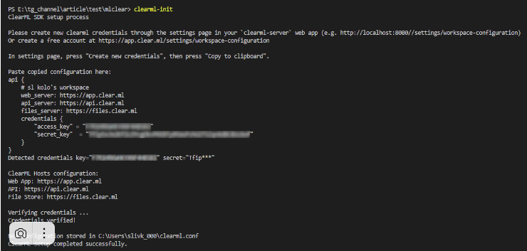
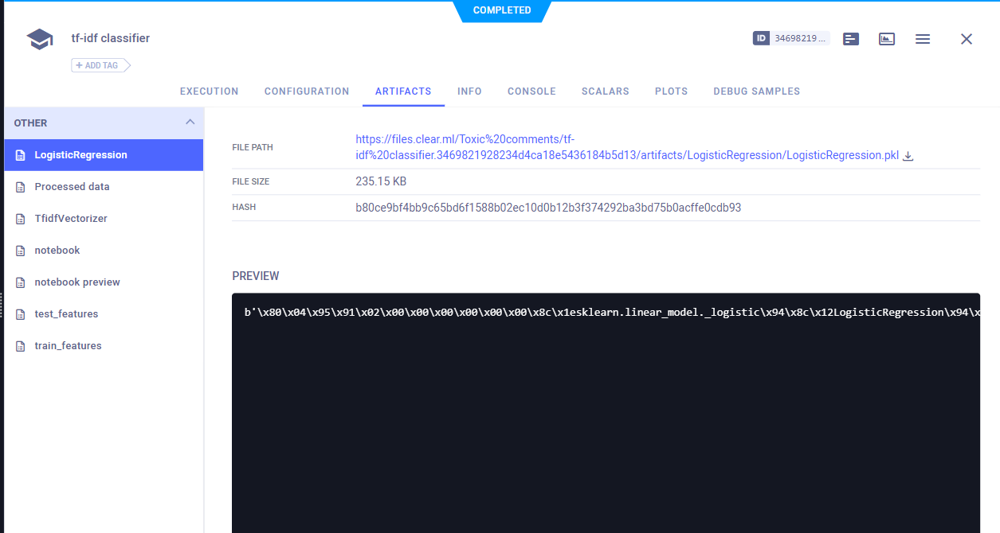
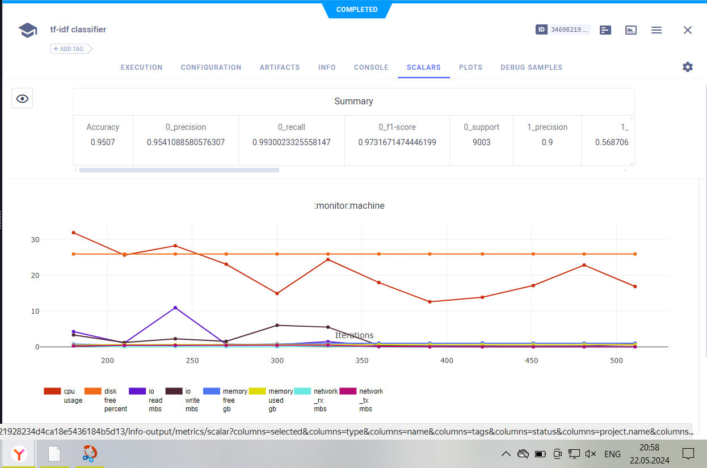
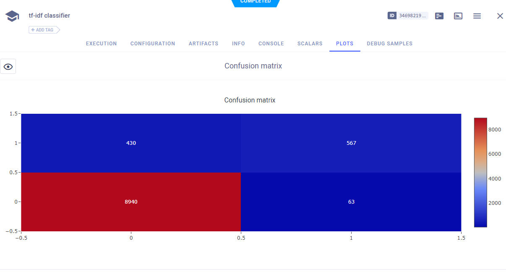
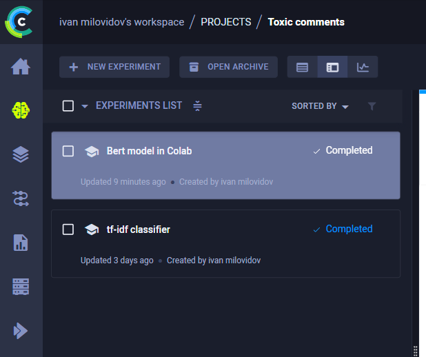

# ClearML 

In this repository, the clearML functionality was used to track experiments in ML.

A comparative machine learning task was performed to classify reviews from the toxic comments dataset (classification task).

## Preparing the environment

for poetry: `poetry add clearml`

for mamba: `mamba create -y -n clearml python=3.10.14 numpy pandas polars clearml scikit-learn matplotlib pytorch transformers hydra-core omegaconf ipykernel jupyter`

## Deployment clearML

1) using docker-compose: use [docker-compose.yaml](clear_ml_infrastucture/docker-compose.yaml) and run:

 ```docker-compose up -d```

then add credential in clearML server cope credentials and after in local machine start:

`clearml-init` 

and then add credentials to clearml.conf:



2) using SaaS: use for this credentials from clerml from web and update or add new credentials in clearml.conf. [docs](https://clear.ml/docs/latest/docs/configs/clearml_conf/)

To authorize on the SaaS platform, you need to get secrets in the settings of your personal profile, and then add them to the environment in any convenient way. Example for Windows Power Shell:

`$env:CLEARML_WEB_HOST="https://app.clear.ml"`\
`$env:CLEARML_API_HOST="https://api.clear.ml"`\
`$env:CLEARML_FILES_HOST="https://files.clear.ml"`\
`$env:CLEARML_API_ACCESS_KEY="XXXXXXXXXXXXXXXX"`\
`$env:CLEARML_API_SECRET_KEY="XXXXXXXXXXXXXXXXXXXXXXXXXXXXXXXXXXXXX"`


Uploading the dataset to the **ClearML** cloud with parameters that will then be used in the notebook:

`clearml-data create --project "Toxic comments" --name "Raw data"`\
`clearml-data add --files data/train.csv`\
`clearml-data close`


## Tracking experiments

1) To start working with ClearML initiate a new session:

```task = Task.init(project_name=projec_name, 
    task_name=TASK_NAME, 
    output_uri=True)
```
This code create project and task in clearML server.

if you want to create new task use new task name.


2) Uploading the dataset to the ClearML cloud with parameters that will then be used in notebooks:

clearml-data create --project "project_name" --name "dataset_name"
clearml-data add --files datad/train.csv
clearml-data close

3) Download from cloud 

```# initialize ClearML tracking
task = Task.init(project_name=cfg.project.name, task_name=TASK_NAME, output_uri=True)

# initialize local version of dataset

dataset = Dataset.get(
    dataset_project=cfg.dataset.project, dataset_name=cfg.dataset.name
).get_local_copy()

task.set_progress(0)
```
4) uploading artifacts

```# fixing artifacts
task.upload_artifact(name="TfidfVectorizer", artifact_object=pickle.dumps(tfidf_vectorizer))

task.upload_artifact(
    name="train_features",
    artifact_object=(train_features, train["toxic"].to_numpy()),
)

task.upload_artifact(
    name="test_features",
    artifact_object=(test_features, test["toxic"].to_numpy()),
)

```


5) logging metrics 

```# Fix progress in CLearML
task.set_progress(95)

# Fix parameters of model
logger = task.get_logger()   

logger.report_single_value("Accuracy", report.pop("accuracy"))

for class_name, metrics in report.items():
    for metric, value in metrics.items():
        logger.report_single_value(f"{class_name}_{metric}", value)
```



Also you can upload plots, for example confusion_matrix



6) After all code runs you need to stop task

`task.close()`

## Compare two experiments

In this task was compare two variants of embeddings 

1)[TF-IDF](code/tf_idf_model.ipynb)

This task was done in local machine using CPU.

2)[BERT](code/BERT_in_Colab.ipynb), and then fitting on them model of Logistic Regression


BERT model was fitted in Google Colab using ClearML Agent.[docs](https://clear.ml/docs/latest/docs/guides/ide/google_colab/)


In clearML server we have 2 completed runs with artifacts, metrics and plots.


Also we can compare logged metrics:


and plots:
